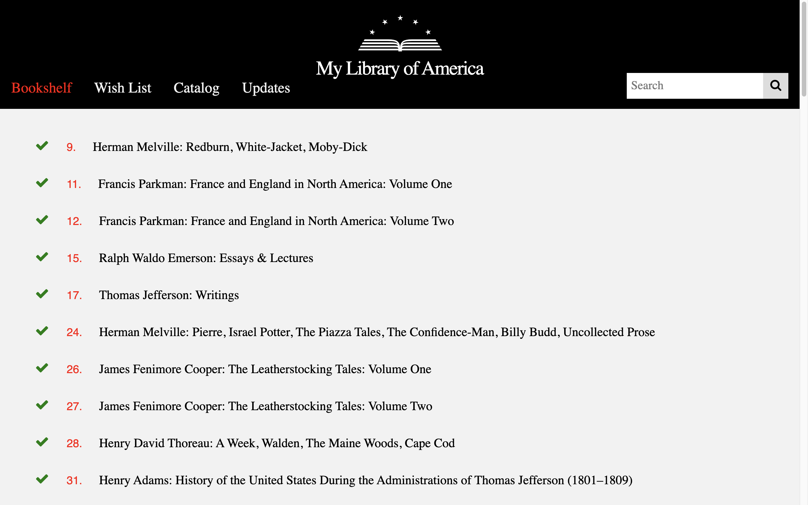
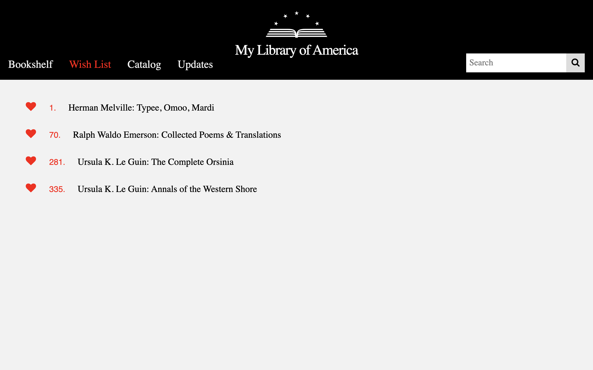
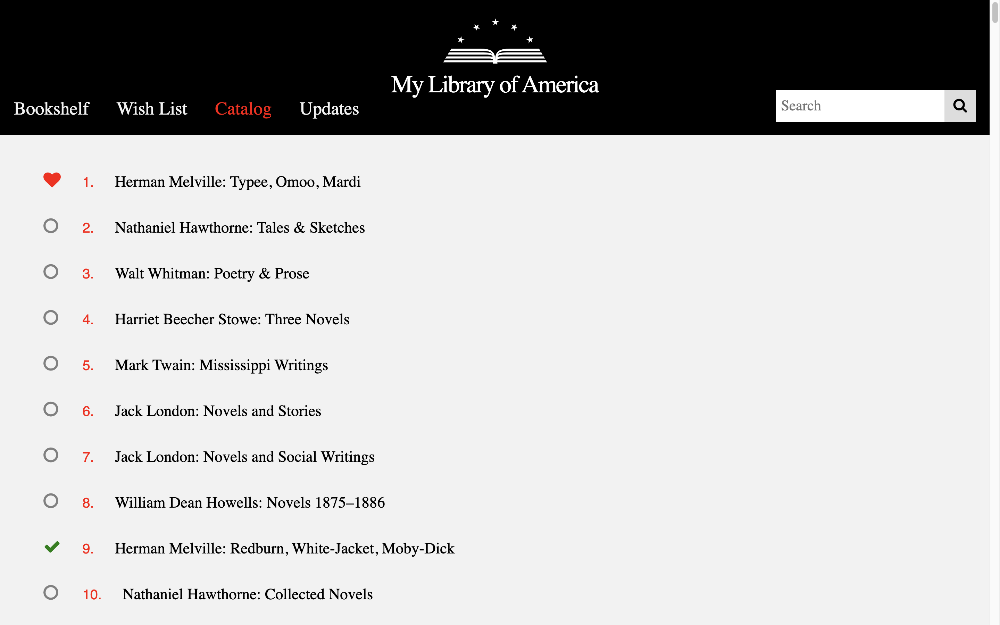
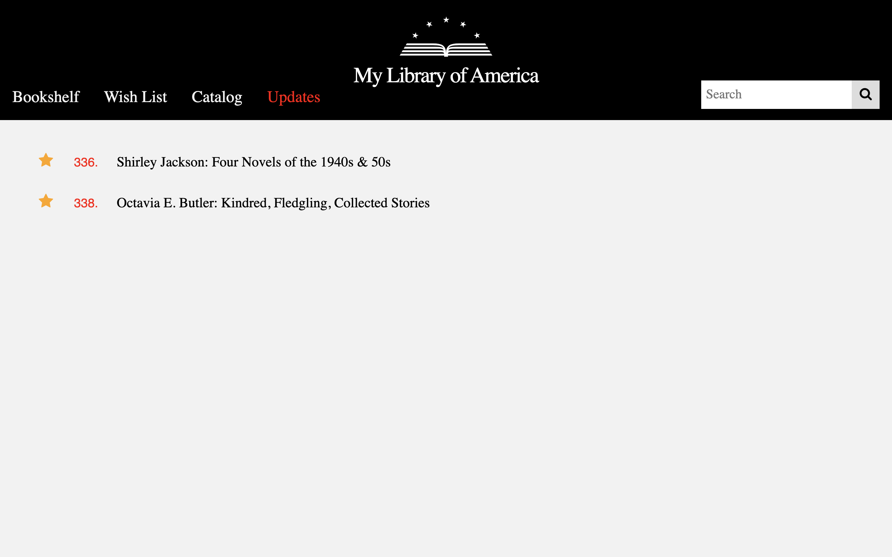
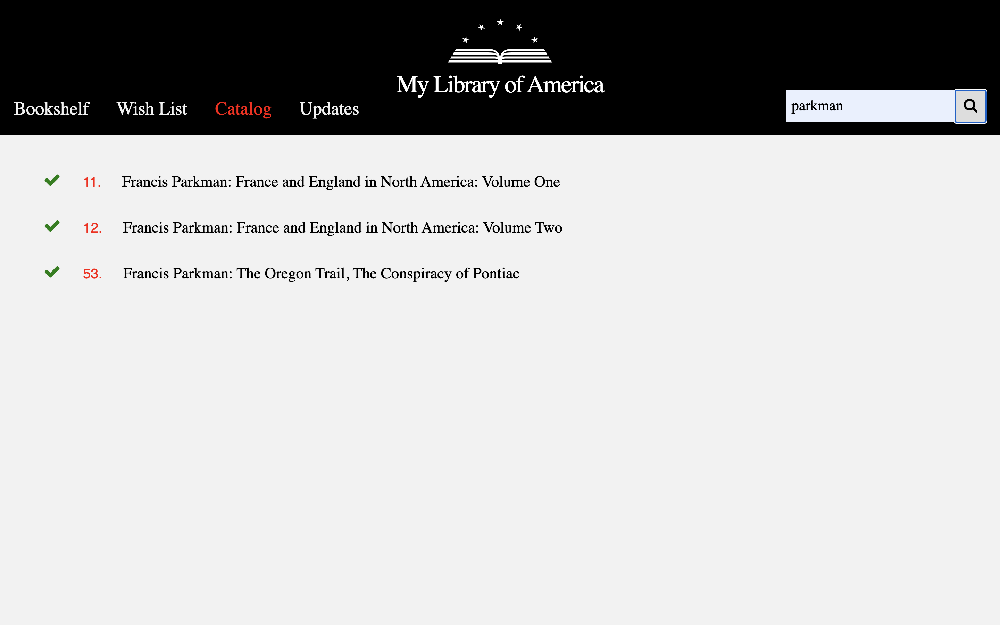

# floa
A single page Flask application to manage my **Library of America** series collection.

The [Library of America](https://log.org) is a non-profit organization which publishes America's greatest writing. They currently have 337 volumes in their series. This application is a personal project to help me manage my bookshelf of these fine volumes.

## Views
The title of each listed volume is a link to that volume's detailed descripton on the LoA website.

### Bookshelf - shows those items on my bookshelf. 

---
### Wish List - those items that I wish were on my bookshelf.

---
### Catalog - all items in the LoA series.

---
### Updates - those items which are new since the last time the local catalog was updated from the LoA site.

---
### Search - those items matching the search results.

## Icons
The icons to the left of each volume's entry are what make the views possible.
These are a multi-state variation of a *checkbox* control. Each click on
the control cycles its state through the four possible values.

**Check mark** => show in Bookshelf

**Heart** => show in Wish List

**Star** => show in Updates

**Circle** => the default and only shown in the Catalog view

